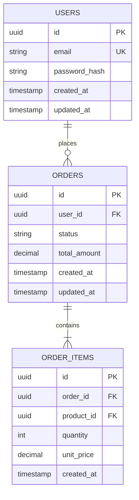

# Step 3b: Database Design

**Agent:** Architect
**Input:** Approved architecture.md
**Output:** `database-design.md`

---

## Instructions

Design the database schema following Constitution conventions.

### Conventions (from Constitution)

- Tables: `snake_case` plurale (`users`, `order_items`)
- Columns: `snake_case`
- Primary Key: `id` UUID v7
- Timestamps: `created_at`, `updated_at` (always)
- Soft delete: `deleted_at` (when needed)
- Foreign Key: `{entity}_id`

---

## Output Template

```markdown
# Database Design: {Feature Name}

## Entity Relationship Diagram



---

## Table Definitions

### Table: `{table_name}`

| Column | Type | Constraints | Description |
|--------|------|-------------|-------------|
| id | UUID | PK | UUID v7 |
| {column} | {type} | {constraints} | {description} |
| created_at | TIMESTAMP | NOT NULL, DEFAULT NOW() | Creation time |
| updated_at | TIMESTAMP | NOT NULL, DEFAULT NOW() | Last update |

**Indexes:**
- `idx_{table}_{column}` on `{column}` - {reason}
- `idx_{table}_{col1}_{col2}` on `({col1}, {col2})` - {reason}

**Constraints:**
- `uk_{table}_{column}` UNIQUE on `{column}`
- `fk_{table}_{related}` FOREIGN KEY `{column}` REFERENCES `{related_table}(id)`

---

## Migrations

### Migration 1: Create {table} table

```sql
CREATE TABLE {table_name} (
    id UUID PRIMARY KEY DEFAULT gen_random_uuid(),
    {column} {TYPE} {CONSTRAINTS},
    created_at TIMESTAMP NOT NULL DEFAULT CURRENT_TIMESTAMP,
    updated_at TIMESTAMP NOT NULL DEFAULT CURRENT_TIMESTAMP
);

CREATE INDEX idx_{table}_{column} ON {table_name}({column});
```

---

## Doctrine Mapping

### Entity: {EntityName}

```php
<?php

declare(strict_types=1);

namespace App\Infrastructure\{Context}\Persistence\Doctrine\Entity;

use Doctrine\ORM\Mapping as ORM;

#[ORM\Entity]
#[ORM\Table(name: '{table_name}')]
class {EntityName}DoctrineEntity
{
    #[ORM\Id]
    #[ORM\Column(type: 'uuid')]
    private string $id;

    #[ORM\Column(type: 'string', length: 255)]
    private string ${column};

    #[ORM\Column(type: 'datetime_immutable')]
    private \DateTimeImmutable $createdAt;

    #[ORM\Column(type: 'datetime_immutable')]
    private \DateTimeImmutable $updatedAt;

    // ... getters, setters, fromDomain(), toDomain()
}
```

---

## Data Integrity Rules

| Rule | Implementation | Enforcement |
|------|----------------|-------------|
| {Rule 1} | {How} | DB / App / Both |
| {Rule 2} | {How} | DB / App / Both |

---

## Performance Considerations

### Expected Data Volume
- {Table 1}: ~{X} rows/month
- {Table 2}: ~{X} rows/month

### Query Patterns
1. **{Query pattern 1}**: Index on {columns}
2. **{Query pattern 2}**: Index on {columns}

### Partitioning (if needed)
{Partitioning strategy or N/A}
```

---

## Human Gate

Present the database design and ask:

> "Ho completato il design del database per **{feature}**.
>
> **Tabelle:** {count}
> **Relazioni:** {count}
> **Indici:** {count}
>
> **Vuoi approvare questo schema?** (sì/no/modifiche)"

If rejected, incorporate feedback and regenerate.
